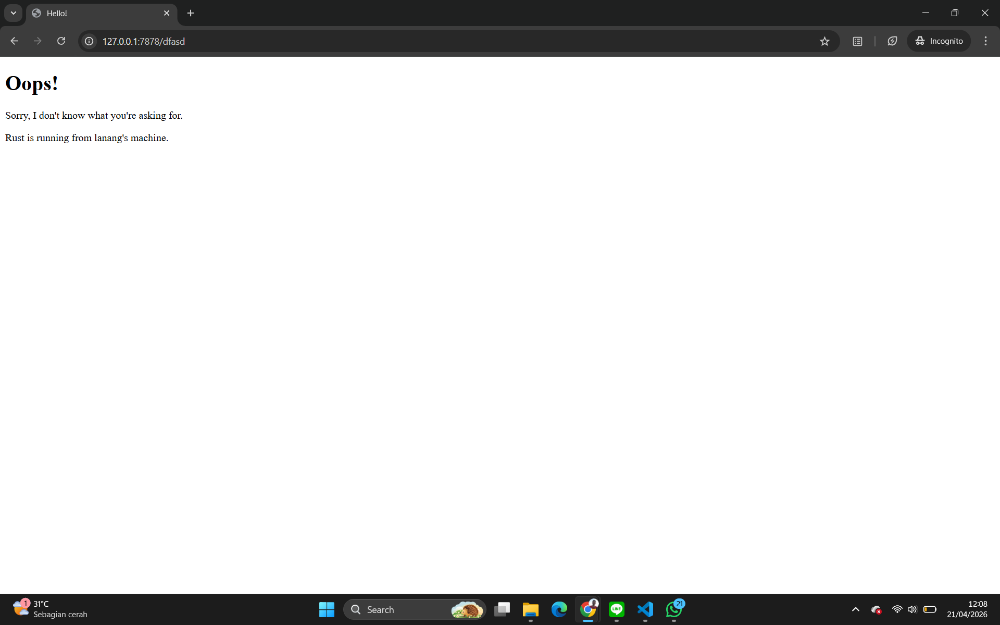

## Reflection for Milestone 1
In this first milestone, I implemented handle_connection function to process incoming TCP streams from the client. Instead of dealing with raw bytes directly, the code wraps the mut TcpStream in a BufReader. This is a crucial step because it provides buffered reading capabilities, making it easier and more efficient to parse the incoming data stream line by line. I learned that a standard HTTP request is just a block of formatted text sent by the browser, which terminates its header section with a single empty line.

To capture and process this, the code utilizes Rust's functional iterator patterns. It calls .lines() on the BufReader to yield a sequence of Result strings, uses .map() to unwrap them, and applies .take_while(|line| !line.is_empty()) to continuously read until it encounters that HTTP-standard blank line. Finally, .collect() gathers all these parsed lines into a Vec<String>, allowing the server to cleanly print and inspect the exact HTTP request headers. Building this manually exposes me to the underlying concept of how web servers and browsers actually communicate, rather than using high-level frameworks.

## Reflection for Milestone 2
In Milestone 2, I expanded the server's capability from simply acknowledging a connection to actually serving a static HTML file back to the client. To achieve this, I use Rust's standard library std::fs module to read the contents of a newly created hello.html file and convert it into String variable. This exercise really highlighted the strict, text-based formatting requirements of the HTTP protocol, as I learned that simply sending the HTML payload is not enough for the browser to understand it. I had to manually construct a valid HTTP response, which required combining the HTTP/1.1 200 OK status line, calculating the Content-Length header, and including the double carriage-return and line-feed (\r\n\r\n) that separates the headers from the actual body content. Finally, because network streams operate on raw bytes rather than Rust's native UTF-8 strings, I used the .as_bytes() method to convert the formatted response before dispatching it over the network using stream.write_all(). Seeing my custom HTML successfully rendered in the browser was quite a fun, now I know how web servers packaging and delivering files over a TCP connection.

## Reflection for Milestone 3
In Milestone 3, I implemented basic request validation to allow the server to selectively respond based on the requested URL path. By isolating the request_line from the incoming stream, the server can evaluate whether the client is requesting the root path ("GET / HTTP/1.1") or any invalid route. To handle the invalid routes, I created a custom 404.html page to serve as a "Not Found" page resposne. When writing the initial routing logic, it became apparent that placing the file reading and network writing operations inside both the if and else blocks would cause  code duplication. To resolve this, I refactored the handle_connection function to only isolate the differing values (the status_line and the filename). By binding these specific values to variables conditionally, the heavy lifting of reading the file (fs::read_to_string) and writing the formatted HTTP response to the TCP stream can be executed unconditionally at the end of the function. This refactoring strategy eliminates repetition, making the server logic much simpler and easier to read, and also easier to scale when adding new routes in the future.

## Reflection for Milestone 4
In Milestone 4, I simulated a slow-loading endpoint by introducing a GET /sleep route that intentionally halts the program's execution using thread::sleep for 10 seconds. Testing this by opening two browser windows to the /sleep route simultaneously provided a clear visualization of the limitations of single-threaded server architecture. While the first browser window loaded after the expected 10-second delay, the second browser window experienced a compounding delay, taking 20 seconds to finish the load. This occurs because the server handles connections strictly sequentially on its single main thread. When the first request triggers the sleep function, the entire thread is blocked and incapable of processing any other incoming connections. As a result, the second request must sit idle in the operating system's TCP backlog queue for the first 10 seconds, and once it is finally accepted by the server, it hits the /sleep route itself, triggering a second 10-second block. Observing this bottleneck clearly demonstrates why production-ready web servers require multithreading to handle concurrent user traffic without catastrophic performance degradation.

## Reflection for Milestone 5
In Milestone 5, I successfully resolved the single-thread bottleneck by implementing a multithreaded ThreadPool. Instead of spawning a completely new thread for every single incoming connection (which could quickly lead to resource exhaustion under heavy traffic) the ThreadPool creates a fixed number of worker threads (in my main.rs, I configured it to 4) upon initialization. To distribute the incoming connection tasks to these workers, I use Rust's multi-producer-single-consumer (mpsc) channel. Because the receiving end of the channel needs to be shared across multiple active worker threads, I wrapped the receiver in an Arc<Mutex<T>>. The Arc (Atomic Reference Counted) pointer allows multiple workers to safely own a reference to the receiver, while the Mutex ensures that only one worker can lock the receiver to pull a job from the queue at any given time, preventing race conditions. The jobs themselves are defined as closures wrapped in a Box<dyn FnOnce() + Send + 'static>, which satisfies Rust's strict concurrency guarantees by ensuring the closures have a known size and can be safely transferred across thread boundaries. Ultimately, by wrapping handle_connection inside pool.execute, the main thread simply hands the connection off to the channel and immediately free to accept the next incoming TCP connection, eliminating the blocking behavior in the previous milestone.

## Reflection for Milestone 6
In this bonus task, I implemented the 'build' function as a safer alternative to the original 'new' function for initializing the ThreadPool. The original implementation relied on the assert!(size > 0) macro, which strictly enforces that the pool size must be greater than zero. While this successfully prevents the creation of an invalid thread pool, it does so by causing the entire web server to panic and crash immediately if a size of zero is accidentally passed. In a production environment, panics are architectural flaws because they disrupt service availability and prevent recovery or cleanup. To resolve this, the new build function uses Rust's error handling by returning a Result<ThreadPool, PoolCreationError> enum instead of unwinding the stack. By returning a Result, the function explicitly forces the caller in main.rs to acknowledge and handle the potential failure state at compile time. Consequently, the server can now gracefully intercept a zero-size configuration, print a descriptive error message to standard error, and perform a controlled, clean shutdown using process::exit(1).